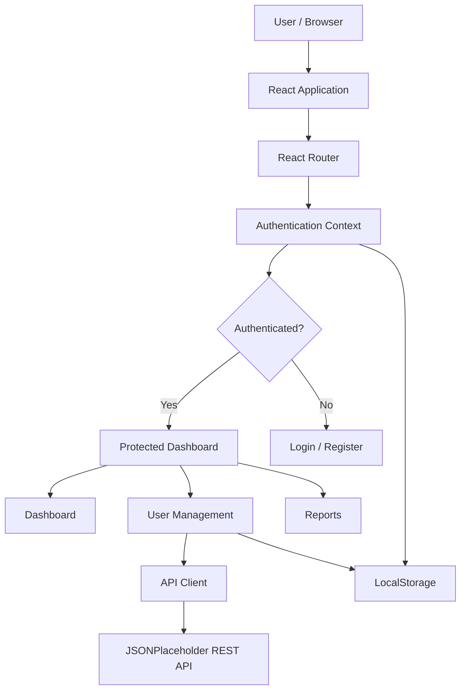

# AccessBoard – Accessible User Management Dashboard

AccessBoard is a responsive and accessible user management dashboard built with React and Vite. It provides user authentication, user management, API integration, and persistent browser storage in a modern dashboard interface.

This project was developed as part of the RabTech Academy Full Stack Development Capstone.

## Features

### Authentication
- User registration and login.
- Protected dashboard routes.
- Logout functionality.
- Persistent login sessions using LocalStorage.
- Duplicate email and invalid credential validation.

### User Management
- Fetch users from JSONPlaceholder REST API.
- Add, edit, and delete users.
- Search users by name or email.
- Filter users by role.
- Sort users by name or email.
- Persist user changes using LocalStorage.
- Loading states, error messages, and empty states.

### Responsive Design
- Mobile-first responsive layout.
- Responsive dashboard and authentication pages.
- Horizontally scrollable user table on smaller screens.
- Theme toggle with light and dark modes.

### Accessibility
- Semantic HTML structure.
- Accessible form labels and validation.
- Keyboard-accessible navigation and controls.
- Skip-to-main-content link.
- Accessible modal dialogs.
- ARIA labels, live regions, and status messages.
- Visible keyboard focus indicators.

## Tech Stack

| Technology | Purpose |
|---|---|
| React | Component-based UI |
| Vite | Development server and build tool |
| React Router | Client-side routing |
| JavaScript | Application logic |
| CSS | Styling and responsive design |
| LocalStorage | Demo authentication and persistent client data |
| JSONPlaceholder | Sample REST API for user data |

## Project Architecture

The application follows a component-based frontend architecture.



## Folder Structure

```text
src/
├── api/
│   └── api.js
├── components/
│   ├── auth/
│   │   └── ProtectedRoute.jsx
│   ├── common/
│   │   └── Modal.jsx
│   └── layout/
│       ├── Header.jsx
│       ├── Sidebar.jsx
│       └── Footer.jsx
├── context/
│   └── AuthContext.jsx
├── pages/
│   ├── Dashboard.jsx
│   ├── Login.jsx
│   ├── Register.jsx
│   ├── Reports.jsx
│   └── Users.jsx
├── App.jsx
├── App.css
└── main.jsx
```

## Authentication Flow

1. A new user registers with their name, email, and password.
2. Registration information is saved in browser LocalStorage.
3. The user is redirected to the login page.
4. Login validates the entered credentials.
5. Authenticated users can access protected dashboard routes.
6. Logout clears the saved session and redirects to login.

> Security note: Authentication is simulated entirely on the frontend. Credentials and session information are stored in LocalStorage. This implementation is for educational demonstration only and is not suitable for production authentication.

## API Integration

The application retrieves sample user information from JSONPlaceholder.

API endpoint:

```text
https://jsonplaceholder.typicode.com/users
```

The API client uses the Fetch API with asynchronous JavaScript and error handling.

Since JSONPlaceholder is a demonstration API, create, update, and delete operations are handled locally in the browser rather than persisted to a remote database.

## LocalStorage Persistence

The application uses browser LocalStorage to preserve data between page refreshes.

| Key | Purpose |
|---|---|
| `rabtech-auth-users` | Registered demo accounts |
| `rabtech-auth-session` | Current login session |
| `rabtech-users-cache` | Cached user data and edits |
| `rabtech-added-users` | Users added locally |
| `rabtech-deleted-users` | Deleted API user IDs |

Clearing browser storage removes the locally saved demo data.

## Installation

### Prerequisites

- Node.js and npm installed.
- Git installed.

### Clone the repository

```bash
git clone https://github.com/Suryaprakash1007/semantic-accessible-dashboard.git
```

Navigate into the project:

```bash
cd semantic-accessible-dashboard
```

Install dependencies:

```bash
npm install
```

Start the development server:

```bash
npm run dev
```

Open the local URL displayed in the terminal, usually:

```text
http://localhost:5173
```

## Production Build

To create an optimized production build:

```bash
npm run build
```

To preview the production build locally:

```bash
npm run preview
```

The production files are generated in the `dist/` directory.

## Deployment

The application can be deployed using static hosting platforms such as Vercel or Netlify.

For deployment, configure the hosting platform to build the Vite application using:

```text
Build command: npm run build
Output directory: dist
```

Configure SPA fallback/rewrite rules so direct navigation to React Router routes such as `/users`, `/login`, and `/reports` serves the application entry point.

## Future Improvements

- Backend authentication with secure password hashing.
- Database integration for permanent user management.
- Role-based authorization.
- Automated unit and integration tests.
- Production API integration.

## Author

**Suryaprakash**

B.Tech – Information Technology  
PSNA College of Engineering and Technology

GitHub: [Suryaprakash1007](https://github.com/Suryaprakash1007)

---

Developed as part of the RabTech Academy Full Stack Development Capstone.